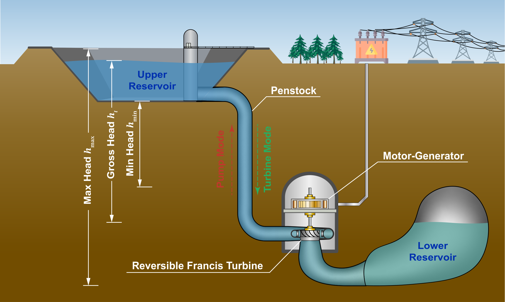
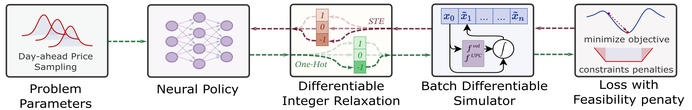
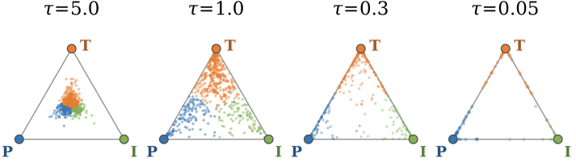
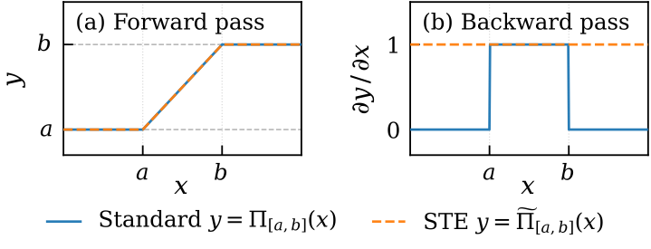
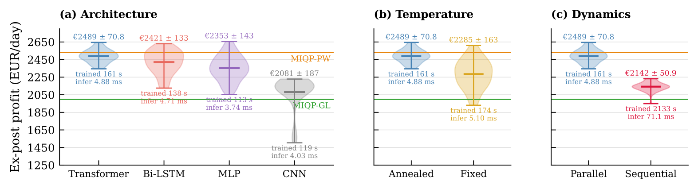
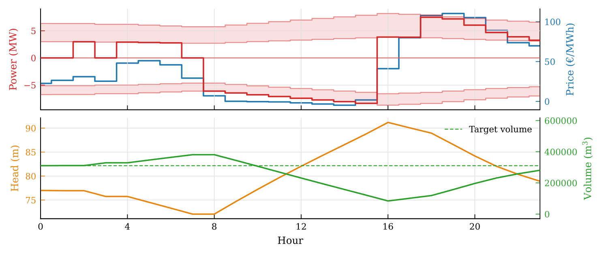

<div align="center">

# MI-DPC for UPHES

**Mixed-Integer Nonlinear Differentiable Predictive Control for Underground Pumped Hydro Energy Storage Systems**

[](https://cdc2026.ieeecss.org/)
[](LICENSE)
[](https://www.python.org/)
[](https://pytorch.org/)
[](https://github.com/pnnl/neuromancer)
[](https://www.gurobi.com/)

</div>

Companion code for the paper **"Mixed-Integer Nonlinear Differentiable Predictive Control for Underground Pumped Hydro Energy Storage Systems"** by Honghui Zheng, Ján Boldocký, Yury Dvorkin, and Ján Drgoňa, accepted at the **IEEE Conference on Decision and Control (CDC) 2026**. The paper link and citation will be added upon publication.

An Underground Pumped Hydro Energy Storage (UPHES) plant arbitrages electricity prices by pumping water to an upper reservoir when prices are low and turbining it back when prices are high. Scheduling it day-ahead is a mixed-integer nonlinear program: every hour the unit picks one of three modes (pump, idle, turbine) and a continuous power setpoint, subject to polynomial unit performance curves and nonconvex volume-head coupling.

<p align="center">
  
</p>

## How it works

MI-DPC trains a Transformer policy that maps the initial hydraulic state and the 24-hour day-ahead price trajectory directly to hourly mode decisions and power setpoints. Training is self-supervised: gradients of the expected ex-post profit flow through a differentiable UPHES simulator and a Gumbel-Softmax straight-through estimator, so no pre-solved optimal schedules are needed.

<p align="center">
  
</p>

Three ingredients make the mixed-integer nonlinear setting trainable:

- **Parallel differentiable simulator.** A two-pass batch rollout replaces the sequential state loop, avoiding vanishing gradients through the 24-step horizon and training 12x faster.
- **Transformer policy.** Self-attention over the full price horizon captures the long-range dependencies that pump-turbine arbitrage requires.
- **Two-stage temperature annealing.** A high Gumbel-Softmax temperature during warm-up encourages mode exploration; exponential decay afterwards sharpens decisions toward hard integer commitments.

| Gumbel-Softmax annealing | Straight-through clamp |
|:---:|:---:|
|  |  |
| Lower temperature concentrates mode samples at the pump/idle/turbine vertices | The STE clamp keeps gradients alive when states saturate physical bounds |

## Results

Mean ex-post profit across 19 held-out benchmark days, evaluated under the exact nonlinear simulator:

| Method | Profit (EUR/day) | Training time | Inference time |
|---|---|---|---|
| MIQP-GL | 1,997 | - | 1.91 s |
| MIQP-PW | 2,530 | - | 918.89 s |
| **MI-DPC (47 seeds)** | **2,489 ± 71** | **161 s** | **4.9 ms** |

MI-DPC reaches within 1.6% of the piecewise MIQP baseline while scheduling a full day in 4.9 ms, five orders of magnitude faster, making it the only method compatible with real-time re-dispatch.

<p align="center">
  
</p>

The converged policy pumps at low prices, turbines at price peaks, and keeps head and volume inside their physical bounds:

<p align="center">
  
</p>

## Repository layout

```
.
├── DPC/                          # MI-DPC implementation (see DPC/README.md)
│   ├── config.py                 # physical constants and hyperparameter defaults
│   ├── dynamics.py               # differentiable UPHES simulators (parallel batch + sequential step) with STE clamp
│   ├── ste.py                    # Gumbel-Softmax straight-through estimator variants
│   ├── system.py                 # policy + STE + simulator assembly (NeuroMANCER)
│   ├── objectives.py             # ex-post profit surrogate and feasibility penalties
│   ├── evaluate.py               # exact ex-post evaluation of trained policies
│   ├── experiments/              # training harness, data sampling, architectures, ablation tooling
│   ├── visualize/                # paper figure scripts
│   └── outputs/benchmark_suite/  # 47-seed ablation summary CSVs and reports
├── MIQP/                         # Gurobi baselines: MIQP-GL (global linearization), MIQP-PW (piecewise SOS2)
├── Data/                         # Belgian Elia day-ahead prices (2024), unit performance curve data
├── figs/                         # paper figures (PDF)
├── assets/                       # README images (PNG)
├── tests/                        # pytest suite
├── preprocessing.py              # UPC surface fitting
├── preprocess.pkl                # preprocessed system parameters
└── requirements.txt
```

## Installation

```bash
conda create -n midpc python=3.11
conda activate midpc
pip install -r requirements.txt
```

The MIQP baselines additionally require a [Gurobi license](https://www.gurobi.com/academia/academic-program-and-licenses/). The paper used PyTorch 2.9.1 (CUDA 13.0), NeuroMANCER 1.5.6, and Gurobi 13.0.0.

## Reproducing the results

All commands run from the repository root.

**Benchmark (Table I).** Train the winning MI-DPC configuration (Transformer, warmup-cosine learning rate, two-stage temperature annealing; frozen as the defaults) and evaluate it on the 19 held-out benchmark days:

```bash
python -m DPC.experiments.benchmark_tuner
```

Solve the MIQP baselines:

```bash
python MIQP/MIQP_linear/MIQP_global_linear.py     # MIQP-GL
python MIQP/MIQP_piecewise/MIQP_piecewise.py      # MIQP-PW
```

**Ablation study.** `generate_ablation_commands` prints a runnable bash script to stdout with one training command per ablation axis (architecture, temperature schedule, simulator); redirect it to a file, execute the file, then summarize the resulting run directories and plot. The paper aggregates seeds 0 through 46; pass the seed list you want via `--seeds`:

```bash
python -m DPC.experiments.generate_ablation_commands --seeds 0,1,2,3,4 > ablation_commands.sh
bash ablation_commands.sh
python -m DPC.experiments.ablation_summary DPC/outputs/benchmark_suite/abl_* --aggregate
python -m DPC.visualize.fig_ablation_violins
```

The committed summary CSVs in `DPC/outputs/benchmark_suite/` back every number in the paper, and `ABLATION_47SEED_RUNS.csv` already contains the full 47-seed results, so the ablation figure and all reported statistics can be verified without retraining.

## Acknowledgments

This work is supported by the Ralph O'Connor Sustainable Energy Institute and by the U.S. DOE, Office of Science, ASCR program under the SciDAC Institute "LEADS: LEarning-Accelerated Domain Science". J.B. acknowledges the support of the Scientific Grant Agency of the Slovak Republic under grant 1/0401/26. Built on the [NeuroMANCER](https://github.com/pnnl/neuromancer) library.

## License

[MIT](LICENSE)
